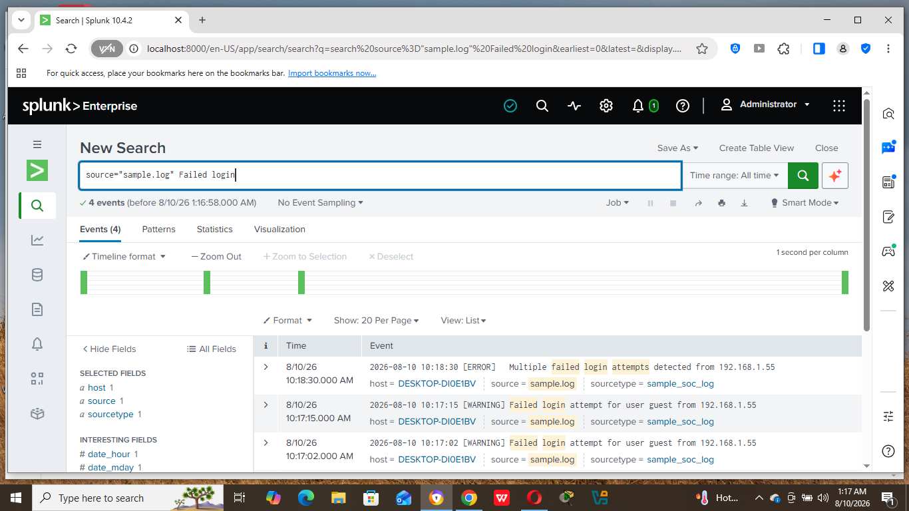

# SIEM Practice — Splunk Log Search & Analysis

## 🎯 Objective

To install Splunk Enterprise, load a sample log file, and practice using Search Processing Language (SPL) to filter and investigate log events — simulating the core daily task of a SOC analyst.

## 🧰 Setup

- **Tool used:** Splunk Enterprise (free trial)
- **Environment:** Windows host machine, `localhost:8000`
- **Data source:** A custom sample log file (`sample.log`) created to simulate authentication events

## 🔍 Sample Log Data

The log file contained the following simulated authentication events:

```
2026-08-10 10:15:23 [INFO] User admin logged in successfully from 192.168.1.10
2026-08-10 10:16:45 [WARNING] Failed login attempt for user guest from 192.168.1.55
2026-08-10 10:17:02 [WARNING] Failed login attempt for user guest from 192.168.1.55
2026-08-10 10:17:15 [WARNING] Failed login attempt for user guest from 192.168.1.55
2026-08-10 10:18:30 [ERROR] Multiple failed login attempts detected from 192.168.1.55
2026-08-10 10:20:00 [INFO] User admin logged out
```

## 📸 Steps Performed & Search Queries

### 1. Data Ingestion
Uploaded `sample.log` through **Add Data → Upload**, confirmed Splunk correctly parsed each line as a separate event with an accurate timestamp, and saved it as a custom source type (`sample_soc_log`).

### 2. Search: All ERROR-level events
```spl
source="sample.log" ERROR
```
**Result:** 1 event — `Multiple failed login attempts detected from 192.168.1.55`

### 3. Search: All INFO-level events
```spl
source="sample.log" INFO
```
**Result:** 2 events — the admin's successful login and later logout

### 4. Search: All WARNING-level events
```spl
source="sample.log" WARNING
```
**Result:** 3 events — three separate failed login attempts for user `guest`, all from `192.168.1.55`

### 5. Search: All events containing "Failed login"
```spl
source="sample.log" "Failed login"
```
**Result:** 4 events — combined the 3 WARNING events with the 1 ERROR event, since all four contain that phrase



## 🧠 Analysis — Connecting the Pattern

Looking at the timeline of events from `192.168.1.55`:

```
10:16:45 → Failed login attempt (guest)
10:17:02 → Failed login attempt (guest)
10:17:15 → Failed login attempt (guest)
10:18:30 → ERROR: Multiple failed login attempts detected
```

Three failed login attempts for the same user, from the same IP, within about 30 seconds, followed immediately by a system-generated error — this is a small-scale, simplified example of exactly the kind of **correlation** a real SIEM performs automatically at scale: individual events are normal on their own, but the *pattern* of repetition from one source is what turns them into something worth investigating.

## 🧠 Key Takeaway (SOC Relevance)

- **SPL (Search Processing Language)** is the core skill for working in Splunk — combining a `source` filter with keywords (`ERROR`, `WARNING`, or phrases like `"Failed login"`) is the most basic but most-used search pattern
- Isolating events by **severity level** (INFO / WARNING / ERROR) is usually the first step in triage — ERROR-level events get priority attention
- Repeated failed logins from a single IP address in a short time window is a classic **brute-force attempt indicator** — in a real environment, this pattern would typically trigger an automated alert rather than requiring manual searching
- This exercise mirrors what I did manually in Windows Event Viewer when filtering for Event ID 4625 (failed logon) — Splunk automates and scales that same investigative process across many log sources at once

## 📌 Notes

This is my first hands-on SIEM writeup, following completion of the Security Fundamentals conceptual notes. The sample data here was manually created for practice; a natural next step would be to import real system logs (e.g. from the Kali VM or Windows Event Viewer) into Splunk for a more realistic investigation exercise.
