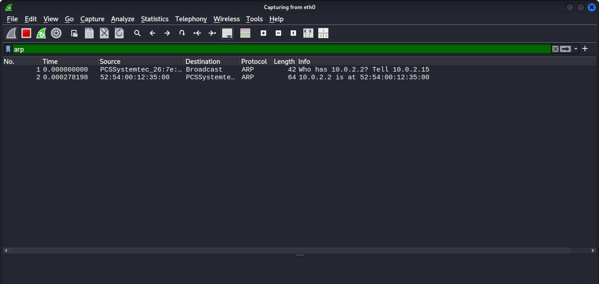
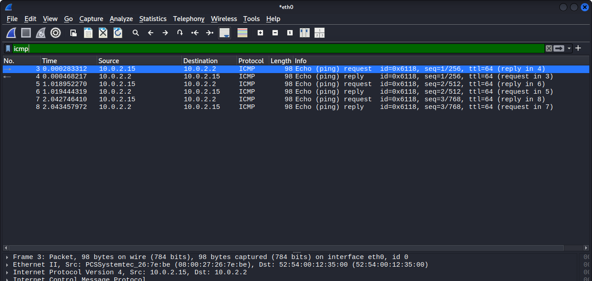

# ARP & ICMP Analysis — Packet Analysis

## 🎯 Objective

To capture and analyze ARP (Address Resolution Protocol) and ICMP (ping) traffic using Wireshark, and understand how a device resolves a local IP to a MAC address, and how ping (Echo Request/Reply) works at the packet level.

## 🧰 Setup

- **Tool used:** Wireshark
- **Environment:** Kali Linux VM (VirtualBox)
- **Target:** Local gateway (`10.0.2.2`) and a public host (`google.com`)
- **Filters applied:** `arp` and `icmp`

## 🔍 Steps Performed

1. Cleared the ARP cache using `sudo ip -s -s neigh flush all` so a fresh ARP resolution would occur
2. Started a Wireshark capture on the `eth0` interface
3. Ran `ping 10.0.2.2 -c 3` (local gateway) from the terminal
4. Also ran `ping google.com -c 5` to capture ICMP traffic to a public host
5. Stopped the capture
6. Applied `arp` filter to isolate ARP resolution packets
7. Applied `icmp` filter to isolate ping request/reply packets

## 📸 Findings — ARP Resolution

### Packet 1 — ARP Request (Broadcast)
- **Source:** PCSSystemtec_26:7e:be (Kali VM's MAC address)
- **Destination:** Broadcast (`ff:ff:ff:ff:ff:ff`)
- **Info:** `Who has 10.0.2.2? Tell 10.0.2.15`

### Packet 2 — ARP Reply
- **Source MAC:** `52:54:00:12:35:00` (gateway)
- **Destination MAC:** PCSSystemtec_26:7e:be (Kali VM)
- **Info:** `10.0.2.2 is at 52:54:00:12:35:00`

Since the ARP cache was cleared beforehand, the client had no known MAC address for the gateway. It broadcast a request to the entire local network asking "who has this IP?" — and only the device holding that IP replied directly with its MAC address. After this exchange, the resolved MAC is cached, so future communication with `10.0.2.2` won't need a new ARP request until the cache expires or is cleared again.

## 📸 Findings — ICMP (Ping)

### Ping to Local Gateway (10.0.2.2)
- **ICMP ID:** `0x6118` (stays constant for the whole ping session — identifies which "conversation" a reply belongs to)
- **Sequence numbers:** 1/256, 2/512, 3/768 — incrementing properly, confirming each reply matched its request
- **TTL:** 64 (default Linux TTL)
- Response times were extremely fast (local network, single hop)

Wireshark automatically links each request to its matching reply (shown as "reply in X" / "request in X" in the Info column), which makes it easy to confirm no packets were lost or mismatched.

### Ping to Public Host (google.com)
- Went through a DNS resolution step first (`A` and `AAAA` queries) before any ICMP packets were sent
- **TTL:** 64
- Response times were noticeably higher (~90–100ms) than the local ping, since traffic left the local network entirely
- One reply had a temporary spike (~1000ms), a normal example of network jitter rather than a connectivity issue

## 🧠 Key Concepts Learned

- **ARP operates only within a local network (broadcast domain)** — it resolves IP addresses to MAC addresses so devices know exactly where (physically, at Layer 2) to deliver a packet
- **ARP caching:** once resolved, a MAC address is cached, meaning ARP requests aren't repeated for every single packet — this is why the ARP request only appeared once, even though multiple pings were sent afterward
- **ICMP Echo Request/Reply** is the mechanism behind the `ping` command — it doesn't use TCP or UDP, but its own IP-layer protocol
- **TTL (Time To Live)** decreases by 1 at every router hop; consistently seeing TTL=64 confirms these were direct/near responses without unusual routing
- **DNS resolution happens before ICMP** when pinging a domain name (like `google.com`) instead of a raw IP — the ping command has to resolve the name to an IP first

## 🧠 Key Takeaway (SOC Relevance)

- **ARP spoofing / ARP poisoning** is a common local-network attack where a malicious device sends forged ARP replies to redirect traffic (e.g., claiming to be the gateway) — recognizing what *normal* ARP resolution looks like (one broadcast request, one direct reply) makes it much easier to spot forged or excessive ARP replies during an investigation
- Unusual patterns like **repeated ARP requests for the same IP**, or a MAC address suddenly changing for a known IP, are red flags worth flagging (classic sign of a man-in-the-middle attempt)
- **ICMP can also be abused** — e.g. in ICMP flood (DoS) attacks or ICMP tunneling for covert data exfiltration. Knowing the expected size, ID pattern, and rate of legitimate ping traffic helps identify abnormal ICMP behavior in logs

## 📌 Notes

This is my fourth Wireshark writeup, following TCP handshake, DNS query analysis, and HTTP traffic analysis. Together, these four captures now cover connection setup (TCP), name resolution (DNS + ARP), and data exchange (HTTP), plus basic network reachability testing (ICMP) — giving a well-rounded, hands-on view of core networking protocols from a security perspective.
