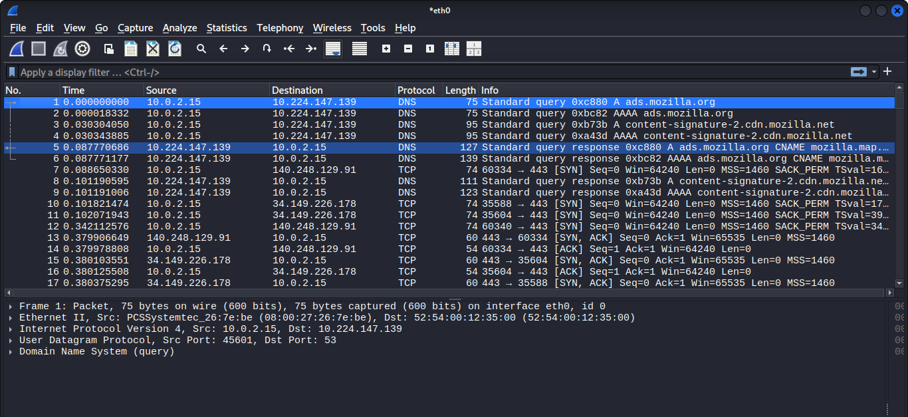
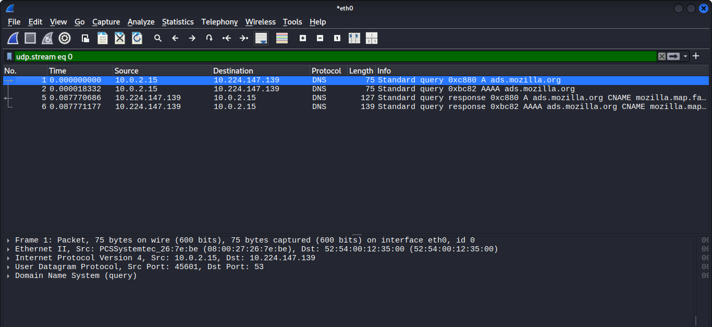

# DNS Query Analysis — Packet Analysis

## 🎯 Objective

To capture and analyze DNS query and response packets using Wireshark, and understand how a domain name gets resolved to an IP address (including CNAME resolution) before a connection is made.

## 🧰 Setup

- **Tool used:** Wireshark
- **Environment:** Kali Linux VM (VirtualBox)
- **Target:** Visited `ads.mozilla.org` related traffic in Firefox while capturing
- **Filter applied:** `udp.stream eq 0`

## 🔍 Steps Performed

1. Opened Wireshark and started a capture on the `eth0` interface
2. Opened Firefox (inside Kali) and triggered a DNS lookup by loading a page
3. Stopped the capture once the page loaded
4. Applied the filter `udp.stream eq 0` to isolate the DNS conversation (DNS runs over UDP port 53)
5. Used "Follow → UDP Stream" to see the full query/response exchange in one view

## 📸 Findings

### Packet 1 — DNS Query (A record)
- **Source IP / Port:** 10.0.2.15 / 45601
- **Destination IP / Port:** 10.224.147.139 / 53
- **Query:** Standard query `0xc880`, type **A** — `ads.mozilla.org`

The client asks the DNS server to resolve the IPv4 address for `ads.mozilla.org`.

### Packet 2 — DNS Query (AAAA record)
- **Source IP / Port:** 10.0.2.15 / 45601
- **Destination IP / Port:** 10.224.147.139 / 53
- **Query:** Standard query `0xbc82`, type **AAAA** — `ads.mozilla.org`

Browsers commonly send both an A (IPv4) and AAAA (IPv6) query at nearly the same time — this is normal "happy eyeballs" behavior, not a duplicate or error.

### Packet 5 — DNS Response (A record)
- **Source IP / Port:** 10.224.147.139 / 53
- **Destination IP / Port:** 10.0.2.15 / 45601
- **Response:** Standard query response `0xc880`, type A — `ads.mozilla.org` **CNAME** `mozilla.map.fastly.net`

### Packet 6 — DNS Response (AAAA record)
- **Source IP / Port:** 10.224.147.139 / 53
- **Destination IP / Port:** 10.0.2.15 / 45601
- **Response:** Standard query response `0xbc82`, type AAAA — same CNAME chain resolved


## 🔎 Follow UDP Stream — CNAME Resolution

Following the UDP stream clearly shows the resolution chain:

```
ads.mozilla.org  →  CNAME  →  mozilla.map.fastly.net
```


## 🧠 Key Observation

`ads.mozilla.org` doesn't resolve directly to an IP — it's aliased (via CNAME) to `mozilla.map.fastly.net`, meaning Mozilla routes this traffic through the **Fastly CDN** rather than hosting it on their own infrastructure directly. This is a common pattern for ad/tracking-related subdomains and CDN-backed services.

## 🧠 Key Takeaway (SOC Relevance)

Understanding normal DNS query/response behavior is important for a SOC analyst because:
- **DNS tunneling attacks** hide data inside DNS queries/responses — recognizing normal query patterns (size, frequency, record types) helps spot abnormal ones
- **DNS spoofing / cache poisoning** can be detected by noticing unexpected or inconsistent responses for the same domain
- Unusually high volumes of DNS queries to unfamiliar domains, or long/randomized-looking subdomains, are common indicators of malware C2 (command-and-control) communication or data exfiltration
- Tracing CNAME chains (like seen here) helps identify what infrastructure/CDN a domain actually relies on, which is useful during investigations

## 📌 Notes

This was my second Wireshark writeup, following the TCP 3-way handshake analysis. Next, I plan to analyze plaintext HTTP traffic to compare it with this DNS lookup and the earlier encrypted TLS connection.
